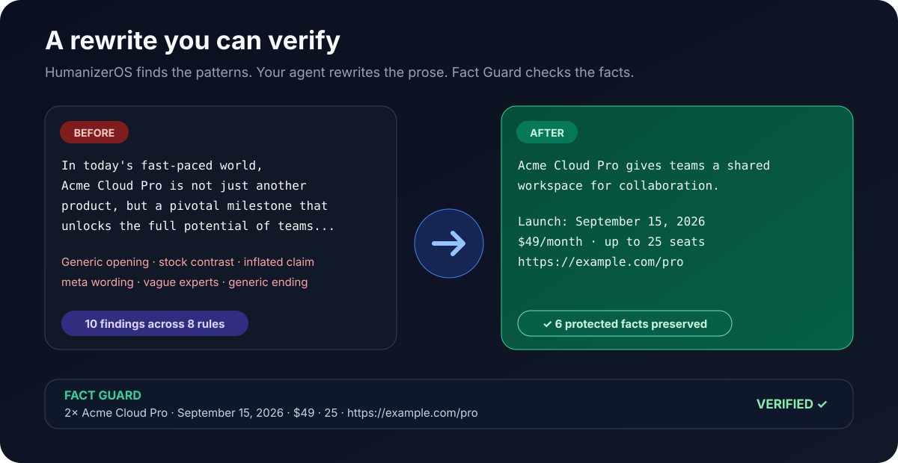

<div align="center">


[](https://github.com/alex-zykin/humanizer-os/actions/workflows/ci.yml)
[](https://www.python.org/)
[](LICENSE)
[](pyproject.toml)
[](README.ru.md)

### AI drafts are fast. Generic writing is expensive.

**HumanizerOS helps your agent make AI-assisted English sound natural, then checks that the facts survived the edit.**

English is the default experience. Russian is available as an optional language switch.

[Install](#install-in-10-seconds) · [Verified demo](#a-rewrite-you-can-verify) · [Claude / Codex](#use-it-with-claude-or-codex) · [How it works](#how-it-works) · [Russian](#russian-when-you-need-it) · [CLI / API](#cli-and-python)

</div>

HumanizerOS is an English-first text-humanization platform for agents, editors, and CI. The project combines an Agent Skill with deterministic analysis, explainable rules, conservative safe fixes, Fact Guard, JSON/SARIF contracts, and a tested local runtime.

It does not claim to prove whether a human or a model wrote a text. It reports observable editorial patterns and gives the agent a safer way to rewrite them.

## Install in 10 seconds

Install the HumanizerOS skill with the open [`skills`](https://github.com/vercel-labs/skills) CLI:

```bash
npx skills add alex-zykin/humanizer-os --skill humanizer-os -g -y
```

Target Codex only:

```bash
npx skills add alex-zykin/humanizer-os --skill humanizer-os -g -a codex -y
```

Target Claude Code only:

```bash
npx skills add alex-zykin/humanizer-os --skill humanizer-os -g -a claude-code -y
```

Target both:

```bash
npx skills add alex-zykin/humanizer-os --skill humanizer-os -g -a claude-code -a codex -y
```

Then reload the agent and ask normally:

```text
Humanize this product announcement. Keep every name, number, date, URL, citation and code block unchanged.

[paste text]
```

The Skill works by itself. Add the CLI when you also want deterministic auditing, safe local fixes, JSON/SARIF output, and Fact Guard:

```bash
pipx install git+https://github.com/alex-zykin/humanizer-os.git
```

## A rewrite you can verify

Most humanizers show only the new wording. HumanizerOS can also show what it found and whether protected values changed.



The source below is intentionally formulaic while carrying real-looking product facts that the rewrite must keep.

**Before**

> In today's fast-paced world, Acme Cloud Pro is not just another productivity tool, but a pivotal milestone that unlocks the full potential of modern teams. It is important to note that our seamless, intuitive, powerful workspace can help to streamline collaboration. Experts believe it will transform the future of work.
>
> Acme Cloud Pro launches on September 15, 2026 at $49/month for teams of up to 25 seats. Details: https://example.com/pro.
>
> In conclusion, the future looks bright.

The deterministic audit returns **10 findings across 8 rules**. It catches the generic opening, stock contrast, two inflated-importance matches, two meta/hedging matches, the adjective stack, vague attribution, the formulaic conclusion, and the generic positive ending.

**After**

> Acme Cloud Pro gives teams a shared workspace for collaboration without the generic launch language around it.
>
> Acme Cloud Pro launches on September 15, 2026 at $49/month for teams of up to 25 seats. Details: https://example.com/pro.
>
> The copy now explains the product directly instead of relying on inflated claims or unnamed experts.

Run Fact Guard on the two files:

```bash
humanizer-os verify \
  examples/product-launch-before.md \
  examples/product-launch-after.md
```

Expected result:

```text
OK  Protected facts match (6 checked).
```

Those six protected facts are two occurrences of `Acme Cloud Pro`, `September 15, 2026`, `$49`, `25`, and `https://example.com/pro`.

The demo is reproducible from [`examples/`](examples/), and a regression test locks the README claims to the current engine.

## Why HumanizerOS

A prompt can produce a better rewrite. HumanizerOS adds a control layer around that rewrite.

| Prompt-only humanizer | HumanizerOS |
|---|---|
| The model decides what looks artificial | Deterministic rules produce stable findings with rule IDs and source spans |
| Fact preservation is an instruction | Fact Guard compares protected values before and after editing |
| Behavior depends heavily on the model | Audit, verification, JSON, SARIF, and safe fixes are model-independent |
| Style guidance is usually one generic policy | Rules can vary by genre and include false-positive boundaries |
| Hard to use in CI | CLI exit codes, SARIF, schemas, tests, and Python API |
| Other languages often inherit translated English rules | Russian is an optional language-native pack with its own catalog |

The goal is simple: let the model handle semantic editing while the engine handles evidence, boundaries, and verification.

## Use it with Claude or Codex

The canonical root [`SKILL.md`](SKILL.md) is English-first and works with the open Agent Skills ecosystem.

Ask for a rewrite:

```text
Humanize this launch post. Keep the claims and technical details, but remove generic AI phrasing.

[paste text]
```

Or point the agent at a file:

```text
Humanize the prose in docs/launch-post.md. Keep code blocks and link targets untouched.
```

Installing the Skill does **not** rewrite every message automatically. It is meant to activate when you ask to humanize, de-template, rewrite, or review prose. Clean text should stay clean.

A full semantic rewrite is performed by the agent. The deterministic CLI only applies replacements that are explicitly marked safe.

The strongest workflow uses both layers:

```text
AI-assisted draft
      ↓
HumanizerOS audit
      ↓
Claude / Codex rewrites the prose
      ↓
Fact Guard verifies protected values
      ↓
final text + explainable changes
```

## How it works

### 1. Detect

The engine looks for observable patterns such as assistant residue, vague attribution, inflated claims, filler, stock contrasts, repeated openings, formatting habits, and contextual structural signals.

Every finding carries a stable rule ID, confidence level, source span, suggestion, genre scope, and provenance.

### 2. Rewrite

The Agent Skill gives those findings to the model as editorial evidence. The model can restructure paragraphs, merge or split sentences, remove formulaic framing, and preserve deliberate voice.

Semantic editing stays with the model because whole-paragraph rewriting is not a safe regex problem.

### 3. Verify

Fact Guard compares protected values between original and revised text. It currently covers:

- numbers, percentages, prices, and common units;
- dates and times;
- URLs, email addresses, handles, and hashtags;
- semantic versions, UUIDs, and commit-like hashes;
- uppercase identifiers;
- inline, fenced, and indented code.

Facts are compared as a multiset, so deleting one of two identical values still counts as a change.

Fact Guard protects deterministic surface values. It does not prove truth or complete semantic equivalence.

## See the engine work

```bash
$ humanizer-os audit launch.md --lang en --genre landing
launch.md  [en/landing]
44 words · 3 sentences · 4 findings · review priority 100/100
W EN-OPEN-001  1:1  Generic scene-setting opening [medium]
W EN-RHET-001  1:34  Not-just contrast [medium]
W EN-LANG-001  1:74  Inflated importance language [medium]
W EN-RHET-003  3:1  Formulaic conclusion [medium]
```


Safe replacements are opt-in:

```bash
$ humanizer-os fix draft.md --diff
-In order to publish, test the release.
+To publish, test the release.
```

## Russian when you need it

English is the default public experience. Russian is available as a supported locale and localized workflow.

Switch the CLI explicitly:

```bash
humanizer-os audit post.md --lang ru --genre social
humanizer-os fix post.md --lang ru --diff
```

The root Skill switches to Russian when the source is clearly Russian or the user asks for Russian. The Russian pack has its own rules for bureaucratic nominalization, `является`, translationese, `не просто X, а Y`, impersonal passive phrasing, templated therapeutic tone, and Russian-specific discourse patterns.

Russian documentation: **[README.ru.md](README.ru.md)**  
Russian-only skill: **[`skills/humanizer-os-ru/`](skills/humanizer-os-ru/)**

## CLI and Python

HumanizerOS requires Python 3.11 or newer.

```bash
git clone https://github.com/alex-zykin/humanizer-os.git
cd humanizer-os
python -m pip install -e .
humanizer-os --version
```

### Core commands

```bash
# Audit English prose
humanizer-os audit article.md --lang en --genre article

# Safe deterministic fixes
humanizer-os fix article.md --lang en --diff
humanizer-os fix article.md --lang en --check
humanizer-os fix article.md --lang en --write

# Verify protected facts after any rewrite
humanizer-os verify original.md revised.md

# Machine-readable reports
humanizer-os audit article.md --lang en --format json > audit.json
humanizer-os audit docs/ --lang en --format sarif > humanizer-os.sarif

# Explore the catalog
humanizer-os rules --lang en --genre article
humanizer-os explain EN-LANG-004

# Measure observable writing characteristics
humanizer-os profile samples/ --lang en --format json
```

### Python API

```python
from humanizer_os import Analyzer, Rewriter, verify_texts

report = Analyzer().audit(
    "In today's fast-paced world, this is not just a tool, but a game-changer.",
    locale="en",
    genre="landing",
)

for finding in report.findings:
    print(finding.rule_id, finding.line, finding.column, finding.message)

rewrite = Rewriter().fix("In order to ship, test.", locale="en")
assert rewrite.revised == "To ship, test."
assert rewrite.verification.ok

assert verify_texts("Price: $49", "The price is $49").ok
```

## What ships today

- one canonical root `SKILL.md` for the open Agent Skills ecosystem;
- 31 English rules in the default pack;
- 34 Russian rules in the optional pack;
- checks for artifacts, content, language, rhetoric, formatting, and structure;
- genre profiles for `general`, `social`, `email`, `landing`, `article`, `docs`, `fiction`, `academic`, and `legal`;
- text, versioned JSON, and SARIF 2.1.0 output;
- CLI, Python API, and locale-specific Agent Skills;
- automated tests plus bilingual eval cases;
- a local runtime with no runtime dependencies or network requests.

The generated catalog is in [docs/RULE_CATALOG.md](docs/RULE_CATALOG.md).

## Repository layout

```text
humanizer-os/
├── SKILL.md                  canonical English-first Agent Skill
├── examples/                 reproducible before/after demos
├── src/humanizer_os/         dependency-free runtime
│   └── data/rules/
│       ├── en/               default English catalog
│       └── ru/               optional Russian catalog
├── skills/
│   ├── humanizer-os-en/      explicit English-only skill
│   └── humanizer-os-ru/      explicit Russian-only skill
├── schemas/                  public JSON contracts
├── evals/                    regression fixtures
├── tests/                    unit, CLI, schema, and eval tests
├── docs/                     methodology and platform docs
└── .github/workflows/        CI, dependency review, releases
```

Read [docs/ARCHITECTURE.md](docs/ARCHITECTURE.md), [docs/METHODOLOGY.md](docs/METHODOLOGY.md), and [docs/PLATFORM.md](docs/PLATFORM.md).

## Quality gates

```bash
python -m pip install -e ".[dev]"
make all
```

The suite checks tests, branch-aware coverage, evals, JSON Schema, documentation links, Ruff, mypy, packaging smoke tests, and a self-audit of public documentation. The verified demo is also tested so the numbers shown above cannot drift silently.

## Roadmap

HumanizerOS is designed as a platform:

- **Core** — analysis, safe fixes, contracts, and Fact Guard;
- **English** — default product language and primary public experience;
- **Russian** — optional language-native pack and localized documentation;
- **Voice** — consented author-sample matching;
- **Providers** — explicit local or hosted model adapters;
- **Studio** — visual audit, diff, profiles, policy, and team workflows;
- **Integrations** — editors, CI, and external products;
- **Expressive RU** — opt-in Russian expression support behind the Russian locale.

See [docs/ROADMAP.md](docs/ROADMAP.md).

## Contributing, privacy, and license

Start with [CONTRIBUTING.md](CONTRIBUTING.md) and [docs/RULE_AUTHORING.md](docs/RULE_AUTHORING.md). Do not submit private user text, proprietary corpora, or unlicensed dictionaries.

HumanizerOS executes none of the analyzed text and makes no network requests in the deterministic core. Security reporting is documented in [SECURITY.md](SECURITY.md).

[MIT](LICENSE) © 2026 Alex Zykin.
