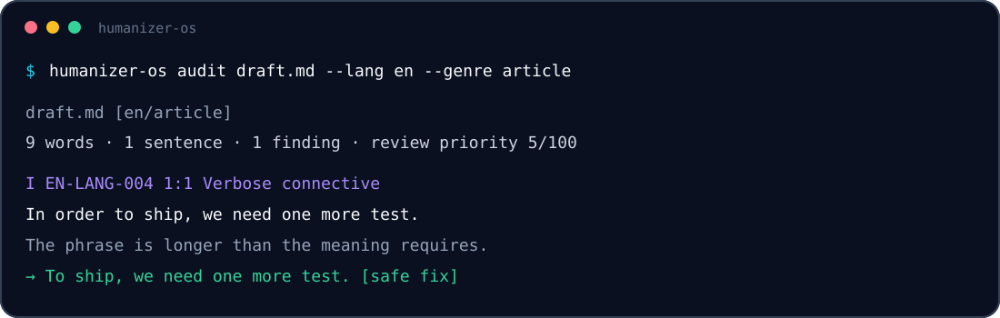

<div align="center">


[](https://github.com/alex-zykin/humanizer-os/actions/workflows/ci.yml)
[](https://www.python.org/)
[](LICENSE)
[](#language-native-by-design)
[](pyproject.toml)

**[Русская версия](README.ru.md)**

</div>

HumanizerOS is a local-first, explainable platform for making English and Russian prose less formulaic without changing its facts. It combines language-native rule packs, deterministic diagnostics, conservative safe fixes, Fact Guard, JSON/SARIF contracts, and Agent Skills.

It does **not** claim to prove whether a human or a model wrote a text. It reports concrete editorial patterns, shows the exact span, and explains what deserves review.

## See it work

```bash
$ humanizer-os audit launch.md --lang en --genre landing
launch.md  [en/landing]
44 words · 3 sentences · 4 findings · review priority 100/100
W EN-OPEN-001  1:1  Generic scene-setting opening [medium]
W EN-RHET-001  1:34  Not-just contrast [medium]
W EN-LANG-001  1:74  Inflated importance language [medium]
W EN-RHET-003  3:1  Formulaic conclusion [medium]
```



Safe replacements are opt-in:

```bash
$ humanizer-os fix draft.md --diff
-In order to publish, test the release.
+To publish, test the release.

$ humanizer-os verify original.md revised.md
OK  Protected facts match (7 checked).
```

## Why HumanizerOS is different

| Principle | In practice |
|---|---|
| **Language-native** | English and Russian use separate catalogs, examples, thresholds, genre limits, and evals. |
| **Fact-safe** | Names, numbers, dates, prices, units, URLs, versions, identifiers, and code are compared before and after a rewrite. |
| **Explainable** | Every finding has a stable rule ID, confidence, exact source span, suggestion, genre scope, and provenance. |
| **Conservative** | Only replacements explicitly marked safe are applied automatically. Everything else remains a review finding. |
| **Local-first** | The core has no runtime dependencies and performs no network requests. |
| **Platform-shaped** | CLI, Python API, JSON, SARIF, schemas, language packs, Agent Skills, and future Studio modules share contracts. |

## Included in 0.1

- 65 built-in rules: 31 English and 34 Russian;
- artifact, content, language, rhetoric, formatting, and structure checks;
- profiles for `general`, `social`, `email`, `landing`, `article`, `docs`, `fiction`, `academic`, and `legal`;
- Fact Guard for protected values and code;
- text, versioned JSON, and SARIF 2.1.0 output;
- `audit`, `fix`, `verify`, `rules`, `explain`, and `profile` commands;
- Python API and three Agent Skills;
- 164 automated tests and 57 bilingual eval cases.

## Installation

HumanizerOS requires Python 3.11 or newer.

```bash
git clone https://github.com/alex-zykin/humanizer-os.git
cd humanizer-os
python -m pip install -e .
humanizer-os --version
```

For an isolated CLI installation:

```bash
pipx install git+https://github.com/alex-zykin/humanizer-os.git
```

## Quick start

```bash
# Audit a file or directory
humanizer-os audit article.md --lang auto --genre article
humanizer-os audit docs/ --lang en --genre docs --fail-on warning

# Machine-readable reports
humanizer-os audit article.md --format json > audit.json
humanizer-os audit docs/ --format sarif > humanizer-os.sarif

# Safe deterministic fixes
humanizer-os fix article.md --diff
humanizer-os fix article.md --check
humanizer-os fix article.md --write

# Fact verification
humanizer-os verify original.md revised.md

# Explore rules
humanizer-os rules --lang ru --genre social
humanizer-os explain RU-LANG-002

# Measure observable writing characteristics
humanizer-os profile samples/ --lang auto --format json
```

## Python API

```python
from humanizer_os import Analyzer, Rewriter, verify_texts

report = Analyzer().audit(
    "In today's fast-paced world, this is not just a tool, but a game-changer.",
    locale="en",
    genre="landing",
)

for finding in report.findings:
    print(finding.rule_id, finding.line, finding.column, finding.message)

rewrite = Rewriter().fix("In order to ship, test.", locale="en")
assert rewrite.revised == "To ship, test."
assert rewrite.verification.ok

assert verify_texts("Price: $49", "The price is $49").ok
```

## Language-native by design

The English pack focuses on vague attribution, inflated importance, generic openings, `not just X but Y`, filler connectives, assistant wrappers, title-case headings, and mechanically even rhythm.

The Russian pack separately checks bureaucratic nominalization, `является`, translationese, `не просто X, а Y`, vague modal claims, impersonal passive phrasing, templated therapeutic tone, assistant artifacts, and discourse uniformity.

The generated catalog is available in [docs/RULE_CATALOG.md](docs/RULE_CATALOG.md). Use `humanizer-os explain RULE_ID` for a rule's full rationale and provenance.

## Fact Guard

Fact Guard protects deterministic surface facts including numbers, percentages, prices, common units, dates, times, URLs, email addresses, handles, hashtags, semantic versions, UUIDs, commit-like hashes, uppercase identifiers, and code.

Facts are compared as a multiset, so removing one of two identical values still counts as a change. Fact Guard does not establish truth or full semantic equivalence; see [docs/LIMITATIONS.md](docs/LIMITATIONS.md).

## Repository layout

```text
humanizer-os/
├── src/humanizer_os/          dependency-free runtime
│   └── data/rules/{en,ru}/    language-native catalogs
├── schemas/                   public JSON contracts
├── skills/                    Agent Skills
├── evals/{en,ru}/             bilingual regression fixtures
├── tests/                     unit, CLI, schema, and eval tests
├── docs/                      methodology and platform docs
└── .github/workflows/         CI, dependency review, releases
```

Read [docs/ARCHITECTURE.md](docs/ARCHITECTURE.md), [docs/METHODOLOGY.md](docs/METHODOLOGY.md), and [docs/PLATFORM.md](docs/PLATFORM.md).

## Quality gates

```bash
python -m pip install -e ".[dev]"
make all
```

The suite includes tests, branch-aware coverage, bilingual evals, schema validation, documentation link checks, Ruff, mypy, packaging smoke tests, and a self-audit of public documentation.

## Roadmap

HumanizerOS is designed as a system rather than one prompt:

- **Core** — analysis, safe fixes, contracts, and Fact Guard;
- **RU / EN** — independent language packs;
- **Voice** — consented author-sample matching;
- **Expressive RU** — opt-in preservation, normalization, masking, and later controlled Russian expression;
- **Providers** — explicit local or hosted model adapters;
- **Studio** — visual audit, diff, profiles, policy, and team workflows;
- **Integrations** — editors, CI, Creator Content OS, and external packs.

See [docs/ROADMAP.md](docs/ROADMAP.md).

## Contributing, privacy, and license

Start with [CONTRIBUTING.md](CONTRIBUTING.md) and [docs/RULE_AUTHORING.md](docs/RULE_AUTHORING.md). Do not submit private user text, proprietary corpora, or unlicensed dictionaries.

HumanizerOS 0.1 executes none of the analyzed text and makes no network requests. Security reporting is documented in [SECURITY.md](SECURITY.md).

[MIT](LICENSE) © 2026 Alex Zykin.
